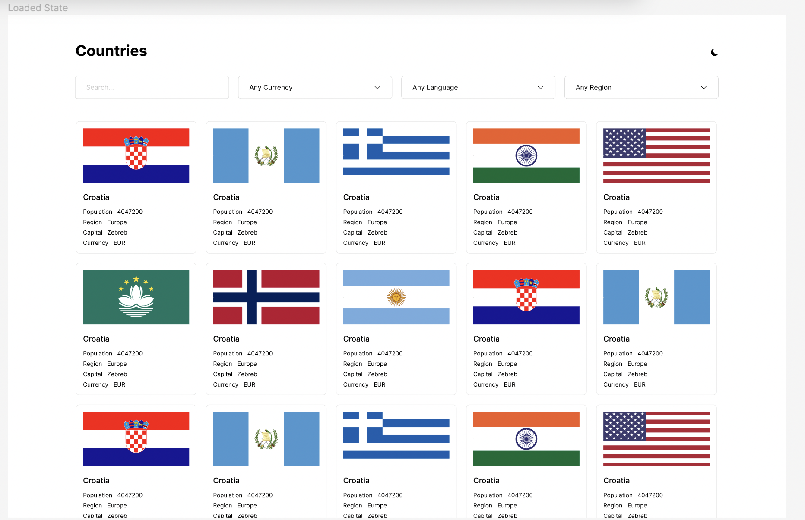

# React Practical

## Overview
Hello! This practical will be used throughout the rest of the course to help develop your skills with React, APIs, and Storyblok. 

## Figma

You will be building the app in accordance with the design in [this figma](https://www.figma.com/file/16Lt0Ll4nTwDqVIlOH0o9C/React-Practical---01?type=design&node-id=1%3A5&mode=design&t=iffjk42G0TjNPpB0-1). **Follow this design as closely as possible**.

## Getting started

Clone this repository using 
```bash
git clone https://github.com/rumoravenue/rumor-react-training-a2.git
```

Make a branch for yourself using
```bash
git checkout -b <your-name>
```

Open the `rumor-react-training-a2/country-dashboard` folder in VSCode.

To run React locally, you must have the following:
- Node.js, follow [instructions to install](https://nodejs.org/en/download).
- yarn, follow [instructions to install](https://classic.yarnpkg.com/lang/en/docs/install).

Run `yarn install` inisde the `country-dashboard` folder to install all dependencies. 

Run `yarn start` to start the React app.

## Part 1: Writing the UI
Complete this part after completing **Module 4: UI with React**. 

In this section, you will implement the components and layout of the application. 

### Requirements and anti-requirements

#### What to do
You **do** have to implement the layout of the **search page** of the country dashboard. The following pages and components should be implemented:

- Search Page: The page that allows the user to search for different countries. 
  - Filter Dropdowns UI
    - To populate the display names and values of each item in the dropdown, you can use the files under `src/data/`
      - Currency Dropdown: `src/data/currency-codes.json`, keys are the **currency code**, use as the **value of the dropdown item**. Values are the **currency name**, use as the **display name** of the dropdown item.
      - Language Dropdown: `src/data/language-codes.json`, keys are the **language code**, use as the **value of the dropdown item**. Values are the **language name**, use as the **display name** of the dropdown item.
      - Region Dropdown: `src/data/regions.json`, array of strings, use the same value for both the **display name** and **value** of the dropdown item.
  - Search Bar UI
  - Country Card UI
    - Display state only, you **do not** need to implement the skeleton state
  - Empty UI: What gets shown when no countries match the filters.

#### What not to do
- You **do not** have to implement any of the logic, such as filtering or searching countries. 
- You will **not** be calling any APIs, you only have to use the data in `country-dashboard/src/data/countries.json`. 
- You **do not** have to implement all of the styling within the Figma, only the layout and components. 
- **Do not** attempt to hardcode the dropdown items, use the values under `src/data/`

### Acceptance Criteria
- The search page should look like the following:

- If the countries array is empty, the search page should look like the following:

- The UI should be constructed using different components, the component structure will be reviewed on submission.

## Part 2: Adding state and talking to the REST Countries API
Complete this part after completing **Module 5: Logic with React**. 

In this section, you will implement storing state and interacting with APIs. 

### Requirements and anti requirements
#### What to do
- Fetch and store the countries array using the `https://restcountries.com/v3.1/all` endpoint. 
- Implement filtering using the filter dropdown and the following endpoints:
  - `https://restcountries.com/v3.1/name/{name}` to search by country name.
  - `https://restcountries.com/v3.1/currency/{currency}` to search by currency code
  - `https://restcountries.com/v3.1/lang/{language}` to search by language code
  - `https://restcountries.com/v3.1/region/{region}` to search by region
- Add a loading state when the API is loading.

#### What not to do
- You **do not** have to implement all of the styling within the Figma, only the layout and components. 
- **Do not** attempt to hardcode the dropdown items, use the values under `src/data/`

### Acceptance Criteria
- When the app is loading, I should see the loading state.

- When I enter a currency into the currency filter, I should only see countries that use that currency. 
- When I enter a language into the language filter, I should only see countries that use that language.
- When I enter a region into the region filter, I should only see countries in that region.
- When I search by the exact name of a country (i.e Canada), I should only see that country.


## Part 3: Adding styling
Complete this part after completing **Module 6: Styling with React**. 

In this section, you will use Chakra UI to implement styling following the Figma above. 

### Requirements
- Text should use Chakra UI
- Input fields should use Chakra UI
- Dark Mode selector should use Chakra UI
- The country cards should use Chakra UI
- The flag images should have the correct aspect ratio.

## Part 4: Adding routing
Complete this part after completing **Module 7: Routing with React**.

In this section, you will add routing to display multiple pages in our React app. 

The first page is the search page, which will be at the `/` route. 


The second page is the country page, which will be stored at the `/:countryCode` route, where `:countryCode` is a path parameter is the [Alpha-2 Country Code](https://www.iban.com/country-codes).


The back button on the top left of the country page should take you back to the `/` route. 

### Requirements
- Search page served at `/`
- Country page served at `/:countryCode` where `:countryCode` is the [Alpha-2 Country Code](https://www.iban.com/country-codes).

- Back button should route to `/`


## Part 5: Incorporating the Storyblok CMS
Coming soon!